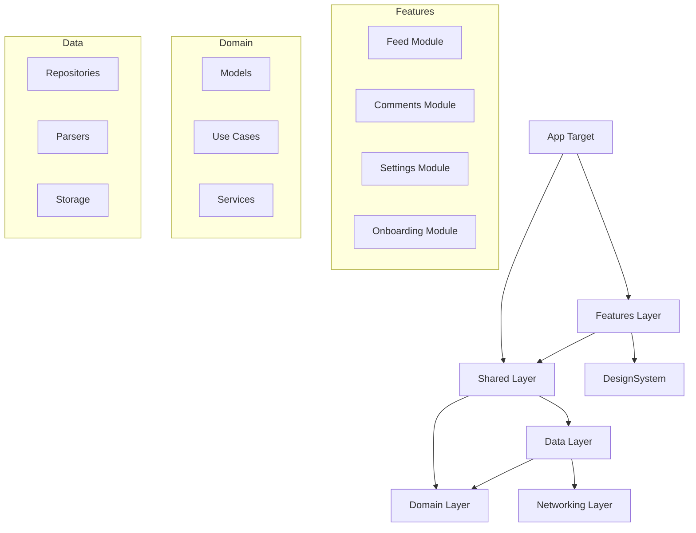
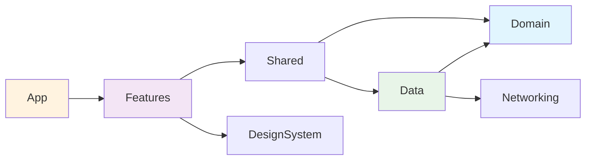
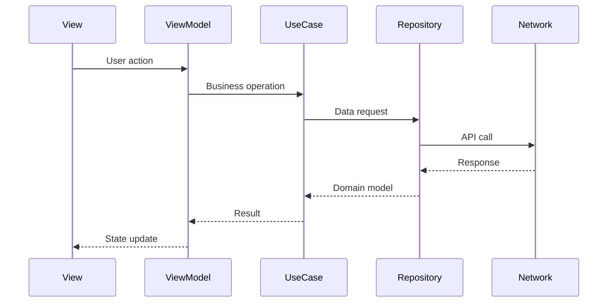

# Architecture Guide

The Hackers iOS app implements **Clean Architecture** principles with modern Swift patterns, providing a maintainable, testable, and scalable codebase.

## 📋 Table of Contents

- [Overview](#overview)
- [Architectural Layers](#architectural-layers)
- [Dependency Flow](#dependency-flow)
- [Module Structure](#module-structure)
- [Design Patterns](#design-patterns)
- [Data Flow](#data-flow)
- [Navigation Architecture](#navigation-architecture)
- [Concurrency Model](#concurrency-model)

## Overview

### Architecture Principles

1. **Separation of Concerns**: Each layer has a single responsibility
2. **Dependency Inversion**: High-level modules don't depend on low-level modules
3. **Testability**: All components are unit testable via protocols
4. **Modularity**: Features are isolated Swift Package Manager modules
5. **Type Safety**: Leveraging Swift's type system for compile-time guarantees

### Architecture Diagram



## Architectural Layers

### 1. App Layer (`App/`)

**Responsibility**: Application lifecycle, dependency injection, main UI coordination

**Key Components**:
- `HackersApp.swift` - SwiftUI app entry point
- `ContentView.swift` - Root UI coordinator
- `AppDelegate.swift` - Legacy UIKit bridge
- `NavigationStore.swift` - Global navigation state

**Technologies**: SwiftUI, UIKit (minimal), Combine

### 2. Features Layer (`Features/`)

**Responsibility**: User interface and presentation logic

**Modules**:
- **Feed** (`Features/Feed/`): Post listing, filtering, voting
- **Comments** (`Features/Comments/`): Comment threads, HTML parsing
- **Settings** (`Features/Settings/`): App preferences, authentication
- **Onboarding** (`Features/Onboarding/`): First-time user experience

**Architecture Pattern**: MVVM with `@Observable` ViewModels

```swift
// Example ViewModel structure
@Observable
class FeedViewModel {
    var posts: [Post] = []
    var isLoading = false
    var error: Error?

    private let postUseCase: PostUseCase
    private let votingService: VotingService

    init(postUseCase: PostUseCase, votingService: VotingService) {
        self.postUseCase = postUseCase
        self.votingService = votingService
    }
}
```

### 3. Shared Layer (`Shared/`)

**Responsibility**: Cross-cutting concerns, navigation, dependency injection

**Key Components**:
- `DependencyContainer` - Centralized dependency injection
- `NavigationCoordinator` - Cross-module navigation
- `LoadingStateManager<T>` - Standardized loading states

### 4. DesignSystem Layer (`DesignSystem/`)

**Responsibility**: Reusable UI components, theme, styling

**Components**:
- `PostDisplayView` - Post presentation component
- `ThumbnailView` - Async image loading
- `LoadingStateView` - Loading indicators
- `AppColors` - Color system

### 5. Domain Layer (`Domain/`)

**Responsibility**: Pure business logic, models, use case contracts

**Structure**:
```
Domain/Sources/Domain/
├── Models/
│   ├── Post.swift
│   ├── Comment.swift
│   ├── User.swift
│   └── VotingState.swift
├── UseCases/
│   ├── PostUseCase.swift
│   ├── CommentUseCase.swift
│   ├── VoteUseCase.swift
│   └── SettingsUseCase.swift
└── Services/
    └── VotingService.swift
```

**Key Principles**:
- No framework dependencies (pure Swift)
- Protocol-based contracts
- Sendable conformance for thread safety
- Rich domain models with behavior

### 6. Data Layer (`Data/`)

**Responsibility**: Data access, API integration, persistence

**Components**:
- `PostRepository` - Implements PostUseCase
- `SettingsRepository` - Implements SettingsUseCase
- HTML parsers and scrapers
- UserDefaults abstraction

### 7. Networking Layer (`Networking/`)

**Responsibility**: HTTP client, network abstraction

**Features**:
- Async/await based API
- Error handling and retries
- Cookie management
- Request/response logging

## Dependency Flow

### Dependency Rules

1. **Outer layers depend on inner layers** (never the reverse)
2. **Dependencies point inward** toward the Domain layer
3. **Protocols define contracts** at layer boundaries
4. **Dependency injection** resolves concrete implementations

### Dependency Graph



## Module Structure

### Swift Package Manager Organization

Each module is a separate Swift Package with:
- **Sources**: Implementation code
- **Tests**: Unit tests
- **Package.swift**: Dependencies and targets

```
Features/Feed/
├── Package.swift
├── Sources/Feed/
│   ├── FeedView.swift
│   ├── FeedViewModel.swift
│   └── PostRowView.swift
└── Tests/FeedTests/
    ├── FeedViewModelTests.swift
    └── MockDependencies.swift
```

### Module Dependencies

```yaml
Dependencies:
  App:
    - Features (all modules)
    - Shared
  Features:
    - Shared
    - DesignSystem
    - Domain (protocols only)
  Shared:
    - Domain
    - Data
  Data:
    - Domain
    - Networking
```

## Design Patterns

### 1. MVVM with Observable

**ViewModels** manage state and business logic:

```swift
@Observable
class CommentsViewModel {
    var comments: [Comment] = []
    var loadingState: LoadingState<[Comment]> = .idle

    @MainActor
    func loadComments(for postId: Int) async {
        loadingState = .loading
        do {
            let comments = try await commentUseCase.getComments(postId: postId)
            loadingState = .loaded(comments)
        } catch {
            loadingState = .error(error)
        }
    }
}
```

### 2. Repository Pattern

**Repositories** implement use case protocols:

```swift
public final class PostRepository: PostUseCase, VoteUseCase, CommentUseCase {
    private let networkManager: NetworkManagerProtocol

    public func getPosts(type: PostType, page: Int) async throws -> [Post] {
        // Implementation
    }
}
```

### 3. Dependency Injection

**DependencyContainer** provides centralized configuration:

```swift
class DependencyContainer {
    static let shared = DependencyContainer()

    lazy var postUseCase: PostUseCase = {
        PostRepository(networkManager: networkManager)
    }()

    lazy var votingService: VotingService = {
        DefaultVotingService(voteUseCase: postUseCase)
    }()
}
```

### 4. Loading State Management

**LoadingStateManager** standardizes async operations:

```swift
@Observable
class LoadingStateManager<T> {
    var state: LoadingState<T> = .idle

    @MainActor
    func load(operation: @escaping () async throws -> T) async {
        state = .loading
        do {
            let result = try await operation()
            state = .loaded(result)
        } catch {
            state = .error(error)
        }
    }
}
```

## Data Flow

### Unidirectional Data Flow



### State Management

1. **View** displays current state
2. **ViewModel** holds observable state
3. **Use Cases** coordinate business operations
4. **Repositories** manage data access
5. **Network** handles external communication

## Navigation Architecture

### NavigationStore Pattern

Centralized navigation state management:

```swift
@Observable
class NavigationStore {
    var selectedPost: Post?
    var navigationPath = NavigationPath()
    var activeSheet: SheetType?

    func navigate(to post: Post) {
        selectedPost = post
        navigationPath.append(NavigationDestination.comments(post.id))
    }
}
```

### Adaptive Navigation

Uses `NavigationSplitView` for iPhone/iPad adaptation:

```swift
NavigationSplitView {
    // Sidebar (iPad) / Primary view (iPhone)
    FeedView()
} detail: {
    // Detail view
    if let selectedPost = navigationStore.selectedPost {
        CommentsView(post: selectedPost)
    } else {
        EmptyStateView()
    }
}
```

## Concurrency Model

### Swift 6 Strict Concurrency

- **@MainActor** for UI components
- **Sendable** protocols for data transfer
- **Actor isolation** for thread safety
- **async/await** for asynchronous operations

### Thread Safety Patterns

```swift
// UI updates on main thread
@MainActor
class FeedViewModel: ObservableObject {
    @Published var posts: [Post] = []

    func loadPosts() async {
        let posts = try await postUseCase.getPosts()
        await MainActor.run {
            self.posts = posts
        }
    }
}

// Sendable data models
struct Post: Sendable {
    let id: Int
    let title: String
    let url: URL?
}
```

### Async Patterns

- **Structured concurrency** with TaskGroup
- **Error propagation** through async throws
- **Cancellation support** for long-running operations

---

## Next Steps

- Review [API Reference](./api-reference.md) for detailed interfaces
- Check [Coding Standards](./coding-standards.md) for implementation guidelines
- See [Testing Guide](./testing-guide.md) for testing patterns