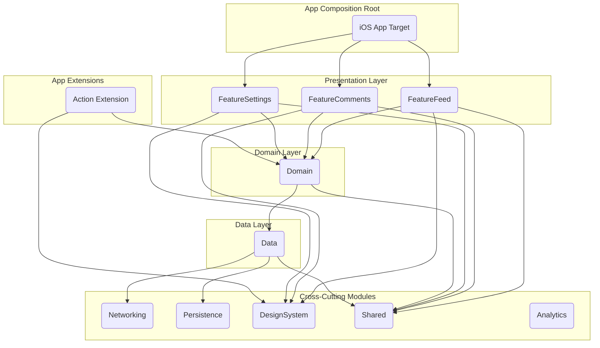

### **Re-Architecture Plan: Hackers for iOS**

**TL;DR:** This document outlines a comprehensive plan to re-architect the Hackers iOS app from its current state into a modern, modular, and highly testable codebase using Swift 6.2 and Clean Architecture. We will incrementally replace legacy components with new, feature-sliced Swift packages, managed by SPM. The process will be guided by a robust testing strategy and automated via CI/CD to ensure quality and stability. The primary goal is to eliminate technical debt, improve developer velocity, and create a scalable foundation for future growth while preserving the existing user experience.

---

### **INPUTS**

| Parameter                   | Value                                                                          |
| :-------------------------- | :----------------------------------------------------------------------------- |
| **App name & domain**       | `Hackers` — A mobile client for the Hacker News social news website.             |
| **Current min iOS version** | iOS 26                                                                         |
| **Target min iOS version**  | iOS 26                                                                         |
| **Key features to preserve**| Feed (Top, New, Best stories), Comments, Settings (Login, Display options).      |
| **Pain points**             | Significant technical debt, monolithic and disorganized architecture, poor testability. |
| **Non‑negotiables**         | Retain the existing UI design and core user-facing behaviors.                  |
| **Team shape**              | 2 Senior Engineers (Gemini, Claude Code).                                      |
| **Timeline & constraints**  | No hard deadline; focus on quality and incremental delivery.                   |
| **External systems**        | Hacker News website (`news.ycombinator.com`). No official API exists; we will continue to rely on web scraping and unofficial endpoints, which must be encapsulated. |

---

### **1. Executive Summary**

**The Why:** The current Hackers codebase is brittle and difficult to maintain due to its monolithic structure and accumulated technical debt. This slows down feature development, introduces regressions, and makes onboarding difficult. A modern re-architecture is necessary to ensure the long-term health and viability of the app.

**The What:** We will execute a phased rewrite using the **Strangler-Fig pattern**. New functionality will be built in isolated Swift packages (Features, Domain, Data) that enforce architectural boundaries. The target architecture is a pure-SwiftUI application leveraging Swift 6's strict concurrency model, managed via a modular SPM-based monorepo.

**Expected Outcomes:**
*   **Velocity:** A modular, testable codebase will allow the team to ship features faster and with higher confidence.
*   **Stability:** A comprehensive testing suite will reduce regressions, targeting a >99.9% crash-free session rate.
*   **Scalability:** A clean, decoupled architecture will make it easier to add new features and adapt to future iOS platform changes.
*   **Developer Experience:** Clear conventions, modern tooling, and fast, reliable CI will create a more productive and enjoyable engineering environment.

**Top Risks & Mitigations:**
| Risk                      | Mitigation                                                                                                                               |
| :------------------------ | :--------------------------------------------------------------------------------------------------------------------------------------- |
| **Migration Complexity:** | Integrating new modules with the legacy UIKit app can be complex. | Use `UIHostingController` and protocol-based adapters to create clean seams. Prioritize one-way data flow from new-to-old where possible. |
| **Unofficial API:**       | Reliance on web scraping is inherently fragile. | Isolate all networking and parsing logic in a dedicated `Data` layer. Use contract tests to quickly detect breaking changes from the website. |
| **Scope Creep:**          | The desire to "fix everything" at once can derail the project. | Adhere strictly to the phased rollout plan. Defer any UI/UX changes until the architectural foundation is in place. |

**High-Level Timeline & Effort:**
| Workstream                      | Effort | Estimated Timeline |
| :------------------------------ | :----- | :----------------- |
| 1. Foundation & CI Setup        | M      | Sprint 1           |
| 2. `Data` & `Domain` Layers     | L      | Sprints 2-3        |
| 3. `FeatureSettings` Module     | M      | Sprints 4-5        |
| 4. `FeatureFeed` Module         | L      | Sprints 6-8        |
| 5. `FeatureComments` Module     | XL     | Sprints 9-12       |
| 6. Legacy Code Decommissioning  | M      | Sprint 13          |

---

### **2. Target Architecture**

The architecture will be composed of three primary layers (Presentation, Domain, Data) and several cross-cutting modules, all defined as distinct Swift packages.

#### **Layered Diagram**



#### **Module Map (SPM Packages)**

| Package           | Purpose                                           | Public API Example                                       | Dependencies                                                  | Test Targets           |
| :---------------- | :------------------------------------------------ | :------------------------------------------------------- | :------------------------------------------------------------ | :--------------------- |
| `App`             | Main application target. Composition root for DI. | `HackersApp.swift`                                       | `FeatureFeed`, `FeatureComments`, `FeatureSettings`, `Analytics` | `AppUITests`           |
| `FeatureFeed`     | Feed screen UI and state management.              | `FeedView(store: Store<...>)`                            | `Domain`, `DesignSystem`, `Shared`                            | `FeatureFeedTests`     |
| `FeatureComments` | Comments screen UI and state management.          | `CommentsView(postID: Int)`                              | `Domain`, `DesignSystem`, `Shared`                            | `FeatureCommentsTests` |
| `FeatureSettings` | Settings screen UI and state management.          | `SettingsView()`                                         | `Domain`, `DesignSystem`, `Shared`                            | `FeatureSettingsTests` |
| `Domain`          | Core business logic, entities, and use cases.     | `protocol PostUseCase { func getFeed() -> [Post] }`      | `Shared`                                                      | `DomainTests`          |
| `Data`            | Repository implementations for the Domain layer.  | `class PostRepository: PostUseCase { ... }`              | `Networking`, `Persistence`, `Shared`                         | `DataTests`            |
| `Networking`      | Typed client for the Hacker News service.         | `func perform<R: Decodable>(request: HNRequest) async throws -> R` | `Shared`                                                      | `NetworkingTests`      |
| `Persistence`     | Local data storage (e.g., SwiftData/Core Data).   | `protocol Cache { func save<T>(T, key: String) }`         | `Shared`                                                      | `PersistenceTests`     |
| `DesignSystem`    | Reusable SwiftUI components, colors, fonts.       | `struct PrimaryButton: View { ... }`                     | `Shared`                                                      | `DesignSystemTests`    |
| `Shared`          | Common extensions, models, and utilities.         | `extension String { ... }`                               | -                                                             | `SharedTests`          |
| `Analytics`       | Abstracted analytics and observability interface. | `protocol AnalyticsService { func logEvent(...) }`       | -                                                             | `AnalyticsTests`       |

#### **Dependency Rules**

This matrix defines the allowed import directions. A `✅` means the row module can import the column module.

|                 | `Shared` | `DesignSystem` | `Networking` | `Persistence` | `Data` | `Domain` | `Feature...` | `App` |
| :-------------- | :------: | :------------: | :----------: | :-----------: | :----: | :------: | :----------: | :---: |
| **`Shared`**    |    -     |       ❌       |      ❌      |       ❌      |   ❌   |    ❌    |      ❌      |   ❌  |
| **`DesignSystem`**|    ✅    |       -        |      ❌      |       ❌      |   ❌   |    ❌    |      ❌      |   ❌  |
| **`Networking`**|    ✅    |       ❌       |      -       |       ❌      |   ❌   |    ❌    |      ❌      |   ❌  |
| **`Persistence`**|    ✅    |       ❌       |      ❌      |       -       |   ❌   |    ❌    |      ❌      |   ❌  |
| **`Data`**      |    ✅    |       ❌       |      ✅      |       ✅      |   -    |    ❌    |      ❌      |   ❌  |
| **`Domain`**    |    ✅    |       ❌       |      ❌      |       ❌      |   ✅   |    -     |      ❌      |   ❌  |
| **`Feature...`**|    ✅    |       ✅       |      ❌      |       ❌      |   ❌   |    ✅    |      -       |   ❌  |
| **`App`**       |    ✅    |       ✅       |      ❌      |       ❌      |   ❌   |    ✅    |      ✅      |   -   |

**Convention: A helper script in CI will enforce these rules by checking for illegal `import` statements.** (See Appendix 10.2)

#### **Concurrency Model**

*   **Swift 6 Strict Concurrency:** The entire project will be compiled with `-strict-concurrency=complete`.
*   **`Sendable` by Default:** All models passed between layers (especially across actor boundaries) **must** conform to `Sendable`. This includes all entities in the `Domain` and `Data` layers.
*   **`@MainActor` Isolation:** All SwiftUI Views, ViewModels, and any classes that touch `UIKit` will be annotated with `@MainActor`. This is the **only** place UI updates may occur.
*   **Actor-based Services:** Shared, mutable state will be protected by `actor`s. For example, `actor SessionService` will manage the user's authentication token.
*   **Structured Concurrency:** We will exclusively use `async/await`, `TaskGroup`, and `async let` for concurrent operations. Unstructured tasks (`Task.detached`) are forbidden unless rigorously justified for specific background work.

#### **Error & Cancellation Strategy**

*   **Typed Errors:** Each layer will define its own specific, `Error`-conforming enums. The `Data` layer will catch network/parsing errors and translate them into `Domain`-level errors (e.g., `NetworkError.offline` -> `FeedError.couldNotReachServer`).
*   **Cancellation:** All `async` operations must be cancellable. `Task.checkCancellation()` will be used in long-running loops. `URLSession` tasks will be cancelled automatically when the parent `Task` is cancelled.

#### **Navigation/Routing Approach**

*   **`NavigationStack`:** We will use a single `NavigationStack` at the root of the app, managed by a `NavigationStore` observable object.
*   **Typed Destinations:** An enum `enum Destination: Hashable, Sendable { case comments(postID: Int), profile(username: String) }` will define all possible navigation targets.
*   **Router Object:** A `Router` object, injected via DI, will be responsible for pushing new destinations onto the stack. This decouples navigation logic from views.
    ```swift
    // In a ViewModel
    func showComments(for post: Post) {
        router.navigate(to: .comments(postID: post.id))
    }
    ```

---

### **3. Code Conventions & Quality Gates**

*   **Swift 6.2 Idioms:** Full adoption of `Sendable`, `async/await`, and actors. Swift Macros will be considered for boilerplate reduction (e.g., `Codable` helpers, DI registration) where they improve clarity.
*   **Linting:** SwiftLint will be configured with a strict ruleset, including custom rules to enforce architectural boundaries (e.g., disallowing `import Data` from `Presentation`).
*   **Formatting:** SwiftFormat will run on every commit via a pre-commit hook to ensure consistent style.
*   **Definition of Done (DoD):** A pull request is not mergeable unless it meets this checklist:
    *   [ ] All new code is covered by relevant tests (Unit, Component, or Feature).
    *   [ ] Code coverage meets or exceeds targets for its layer.
    *   [ ] All UI elements are accessible (VoiceOver labels, Dynamic Type support).
    *   [ ] All user-facing strings are localized.
    *   [ ] CI pipeline passes (build, lint, all test suites).
    *   [ ] Self-approved by author and approved by at least one other engineer.

---

### **4. Testing Strategy (Deep-dive)**

#### **Unit Tests (Domain Layer)**
*   **Tool:** Swift Testing (`#expect`).
*   **Scope:** Test pure business logic, algorithms, and transformations within the `Domain` module. No dependencies on other layers.
*   **Example:**
    ```swift
    @Test func postScoreIsCalculatedCorrectly() {
        let post = Post(id: 1, score: 100, commentCount: 50)
        let weightedScore = post.calculateWeightedScore()
        #expect(weightedScore == 150)
    }
    ```

#### **Component Tests (ViewModels, Services)**
*   **Tool:** Swift Testing with fakes.
*   **Scope:** Test individual components (e.g., a `FeedViewModel`) in isolation by providing mock/fake implementations of its dependencies.
*   **Example:**
    ```swift
    @MainActor
    @Test func viewModelFetchesPostsOnAppear() async throws {
        // Arrange
        let fakeUseCase = FakePostUseCase(stubbedFeed: [Post.mock])
        let viewModel = FeedViewModel(postUseCase: fakeUseCase)

        // Act
        await viewModel.onAppear()

        // Assert
        #expect(viewModel.posts.count == 1)
        #expect(viewModel.posts.first?.id == Post.mock.id)
        #expect(fakeUseCase.getFeedCallCount == 1)
    }
    ```

#### **Feature Tests (Module End-to-End)**
*   **Tool:** XCUITest with launch arguments.
*   **Scope:** Test the entire flow of a single feature module (`FeatureFeed`) with mocked `Data` layer dependencies.
*   **Example:**
    ```swift
    // In the test
    app.launchArguments = ["-mockNetwork", "-mockFeed", "success_full"]
    app.launch()
    XCTAssertTrue(app.staticTexts["Welcome to Hackers"].waitForExistence(timeout: 5))

    // In the App composition root
    #if DEBUG
    if CommandLine.arguments.contains("-mockNetwork") {
        container.register(PostUseCase.self) { MockPostRepository(scenario: CommandLine.arguments[2]) }
    }
    #endif
    ```

#### **Screenshot Tests**
*   **Tool:** `pointfreeco/swift-snapshot-testing`.
*   **Policy:** Generate snapshots for key screens in a feature module across a defined device matrix. Snapshots are stored in the repo. Diffs are posted as PR comments.
*   **Device Matrix:** iPhone 15 Pro (iOS 26), iPhone SE (3rd gen, iOS 26), iPad Pro 11" (iOS 26).
*   **Threshold:** 0% diff tolerance. Any change must be explicitly approved by updating the reference image.

#### **E2E/UI Tests**
*   **Tool:** XCUITest.
*   **Scope:** Test critical user flows across multiple features (e.g., Login -> View Feed -> Open Comments).
*   **Data Seeding:** Use a combination of launch arguments and a local debug server that can serve predictable JSON fixtures. Avoid testing against the live Hacker News site.

#### **Performance Tests**
*   **Tool:** Xcode Performance Targets (`measure { ... }`).
*   **Metrics:** App launch time (cold/warm), feed scroll hitch rate, memory usage. Budgets will be set and CI will fail if they are exceeded.

#### **Coverage Policy**
| Layer        | Target | Justification                                                        |
| :----------- | :----: | :------------------------------------------------------------------- |
| `Domain`     | ≥ 90%  | Pure logic, easy to test, critical for correctness.                  |
| `Data`       | ≥ 85%  | Covers repository logic and error mapping. Network/DB interaction is mocked. |
| `Presentation` | ≥ 80%  | Covers ViewModel logic. Views are tested via Screenshots/UI tests.   |

---

### **5. CI/CD Pipeline**

We will use **GitHub Actions** to automate our workflows, replacing the core functionality of the existing Fastlane setup.

**Branch Strategy:** `main` is protected. All work happens on feature branches (`feature/TICKET-123-description`). PRs to `main` require passing all checks.

**GitHub Actions Workflow (`ci.yml`):**
```yaml
name: CI
on: [pull_request]

jobs:
  build_and_test:
    runs-on: macos-latest # Or a self-hosted runner with specific Xcode
    steps:
    - uses: actions/checkout@v4
    - name: Cache SPM dependencies
      uses: actions/cache@v4
      with:
        path: .build
        key: ${{ runner.os }}-spm-${{ hashFiles('**/Package.resolved') }}

    - name: Lint
      run: swiftlint --strict

    - name: Unit & Component Tests
      run: xcodebuild test -scheme Hackers -destination 'platform=iOS Simulator,name=iPhone 15 Pro' -enableCodeCoverage YES

    - name: Upload Coverage
      uses: codecov/codecov-action@v4

    - name: UI & Screenshot Tests
      run: xcodebuild test -scheme HackersUITests -destination 'platform=iOS Simulator,name=iPhone 15 Pro'

    - name: Upload Screenshot Diffs
      # ... action to upload artifacts ...
```

---

### **6. Migration & Coexistence Plan**

#### **Strangler-Fig Approach**
1.  **Identify a Seam:** Choose a simple, isolated screen to start (e.g., Settings).
2.  **Build the New Module:** Implement the `FeatureSettings` package in SwiftUI.
3.  **Create an Adapter:** The legacy `SettingsViewController` will be replaced. The navigation action that previously pushed it will now instantiate a `UIHostingController` with the new SwiftUI `SettingsView`.
    ```swift
    // Legacy navigation code
    let settingsView = SettingsView() // New SwiftUI View
    let hostingController = UIHostingController(rootView: settingsView)
    navigationController?.pushViewController(hostingController, animated: true)
    ```
4.  **Route Traffic:** All entry points to the settings screen now point to the new implementation.
5.  **Repeat:** Continue this process for Comments, then the Feed, until all legacy view controllers are replaced.

#### **Phased Rollout**
We will use a simple, local feature flag system (e.g., a `FeatureFlags.plist` file) to enable/disable new features during development. This allows us to merge incomplete work to `main` behind a flag.

#### **Data Migration**
The existing app does not appear to have complex local persistence. If we introduce SwiftData for caching, we will manage migrations using standard versioning. There is no user data that needs two-way sync.

---

### **7. Security & Privacy**

*   **Data Storage:** User credentials for Hacker News will be stored securely in the **Keychain**. No other PII is handled.
*   **Networking:** All traffic will use HTTPS. We will enforce App Transport Security (ATS). Certificate pinning is overkill for this application.
*   **Dependencies:** All third-party SPM packages will be reviewed for security vulnerabilities.

---

### **8. Observability & Product Analytics**

*   **Logging:** A lightweight `OSLog` wrapper will provide structured logging with different subsystems (e.g., `Networking`, `UI`) and levels (debug, info, error).
*   **Crash Reporting:** We will integrate a standard crash reporter (e.g., Firebase Crashlytics) via the `Analytics` module.
*   **Performance Monitoring:** Key metrics (app start, feed load time) will be tracked with `MetricKit` and custom signposts, and sent as analytics events.
*   **KPIs:**
    *   Crash-Free Session Rate: > 99.9%
    *   Cold Start Time: < 1.5s
    *   Feed Time-to-Interactive (TTI): < 2s on a standard connection.

---

### **9. Acceptance Criteria & Success Metrics**

**Pre-Launch Gates (per feature):**
*   Code coverage targets are met.
*   Performance budgets are not exceeded.
*   All accessibility checks (VoiceOver, Dynamic Type) pass.
*   No P1/P2 bugs are open for the feature.

**Post-Launch Success:**
*   The re-architected app maintains or improves its App Store rating.
*   Developer velocity, measured by PR cycle time, improves by at least 25% within 3 months.
*   The rate of regressions decreases over time.

---

### **10. Appendices (Templates & Samples)**

*   **10.1. SPM Package Layout Template (`Package.swift`)**
    ```swift
    // swift-tools-version: 6.0
    import PackageDescription

    let package = Package(
        name: "FeatureFeed",
        platforms: [.iOS(.v26)],
        products: [
            .library(name: "FeatureFeed", targets: ["FeatureFeed"]),
        ],
        dependencies: [
            .package(path: "../Domain"),
            .package(path: "../DesignSystem"),
        ],
        targets: [
            .target(
                name: "FeatureFeed",
                dependencies: ["Domain", "DesignSystem"]
            ),
            .testTarget(
                name: "FeatureFeedTests",
                dependencies: ["FeatureFeed"]
            ),
        ]
    )
    ```

*   **10.2. Module Boundary Test Helper**
    ```swift
    // In a test utility package, run as part of CI
    import Foundation

    func enforceBoundary(for module: String, in file: StaticString) throws {
        let fileContent = try String(contentsOfFile: file.description)
        if module == "Domain" && fileContent.contains("import Presentation") {
            fatalError("Domain module cannot import Presentation layer!")
        }
        // ... other rules
    }
    ```

*   **10.3. XCUITest Launcher with Stubbing**
    ```swift
    // HackersUITests.swift
    class FeedFlowTests: XCTestCase {
        let app = XCUIApplication()

        override func setUpWithError() throws {
            continueAfterFailure = false
            app.launchArguments = ["-ui-testing", "-mock-feed", "success"]
            app.launch()
        }
        // ... tests
    }
    ```

*   **10.4. OSLog Wrapper**
    ```swift
    import OSLog

    struct Log {
        private static let subsystem = Bundle.main.bundleIdentifier!
        static let ui = Logger(subsystem: subsystem, category: "UI")
        static let network = Logger(subsystem: subsystem, category: "Network")

        static func info(_ message: String, logger: Logger = ui) {
            logger.info("\(message)")
        }
    }
    ```

*   **10.5. Feature Module Skeleton**
    ```swift
    // --- FeedView.swift ---
    import SwiftUI
    import Domain

    @MainActor
    final class FeedViewModel: ObservableObject {
        @Published var posts: [Post] = []
        private let useCase: PostUseCase
        init(useCase: PostUseCase) { self.useCase = useCase }
        func loadFeed() async {
            posts = try? await useCase.getFeed(for: .top)
        }
    }

    struct FeedView: View {
        @StateObject private var viewModel: FeedViewModel
        init(viewModel: FeedViewModel) { _viewModel = StateObject(wrappedValue: viewModel) }
        var body: some View {
            List(viewModel.posts) { post in Text(post.title) }
            .task { await viewModel.loadFeed() }
        }
    }
    ```

---

### **Analysis of Ice Cubes App & Adaptations for Hackers**

The Ice Cubes app is an excellent reference for a modern, modular SwiftUI application.

**Five Practices to Emulate from Ice Cubes:**

1.  **SPM-First Modularity:** Ice Cubes is heavily modularized into packages like `Network`, `DesignSystem`, `AppAccount`, and various feature modules. We will adopt this exact strategy.
2.  **Lean State Management:** It primarily uses `@StateObject` for ViewModels and `@EnvironmentObject` for shared services, avoiding heavy third-party state management libraries. This aligns with our goal of a lean MVVM approach.
3.  **Async-Centric Networking:** Its `Network` layer is built entirely on `async/await`, providing a clean, modern API for features to consume. Our `Networking` module will be modeled directly on this pattern.
4.  **Environment-based DI:** Services are injected into the SwiftUI `Environment`, making them easily accessible to any view in the hierarchy. This is a lightweight and effective DI pattern for SwiftUI apps.
5.  **Dedicated `DesignSystem` Package:** All reusable UI components, colors, and fonts are in a separate package. This enforces consistency and is a practice we will replicate.

**Five Gaps or Differences to Address for Hackers:**

1.  **Testing Strategy:** While Ice Cubes has tests, our plan calls for a more rigorous, multi-layered testing strategy with explicit coverage targets per architectural layer (Domain, Data, Presentation). We will also add automated screenshot and performance testing to CI, which is less formalized in Ice Cubes.
2.  **Architecture Enforcement:** Ice Cubes's architecture is clean but relies on convention. We will introduce **automated checks in CI to enforce dependency rules**, preventing accidental coupling between layers (e.g., a `Domain` module importing `UIKit`).
3.  **State Management Formalism:** For complex screens like Comments, which involve deep hierarchies and complex state interactions, a simple `@StateObject` may lead to tangled logic. We will adopt a more structured, reducer-like pattern *within* those specific feature modules, inspired by TCA but without the external dependency. This provides more predictability than a standard MVVM approach for complex cases.
    *   **Adaptation:** A feature's `ViewModel` can contain a `reduce(_ action: Action)` method to handle all state mutations, making logic easier to follow and test.
4.  **External Dependency Resilience:** Ice Cubes connects to a documented Mastodon API. Hackers relies on web scraping. Our `Data` layer must be more defensive, with built-in contract tests that validate our parsing logic against cached HTML fixtures. This ensures we are immediately alerted if the Hacker News site structure changes.
5.  **Migration Plan:** Ice Cubes was a SwiftUI-native project. Our biggest challenge is the incremental migration from a legacy UIKit app. Our plan explicitly details the **Strangler-Fig pattern, adapter protocols, and `UIHostingController` strategies**, which are unique requirements for the Hackers project.